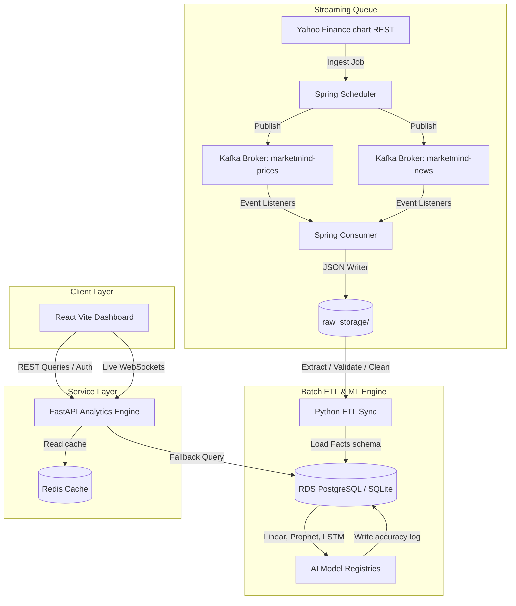
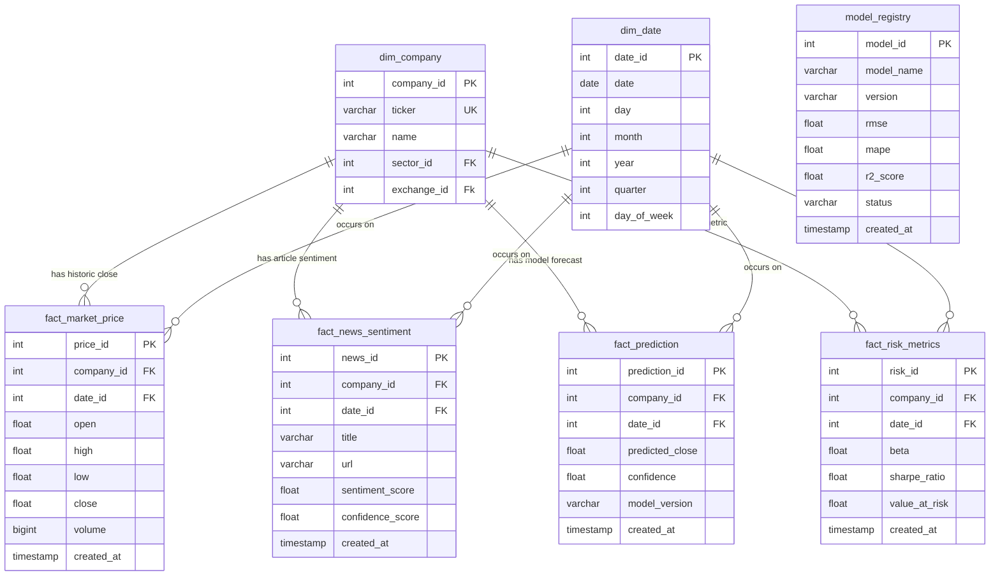
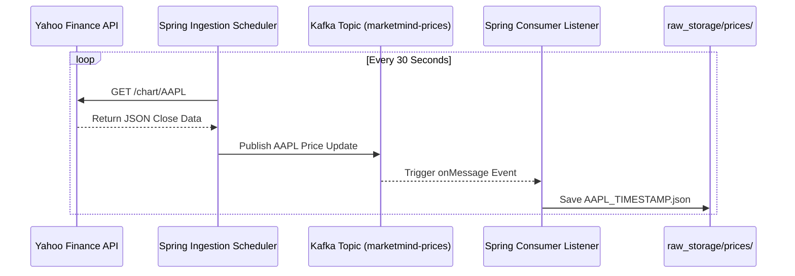
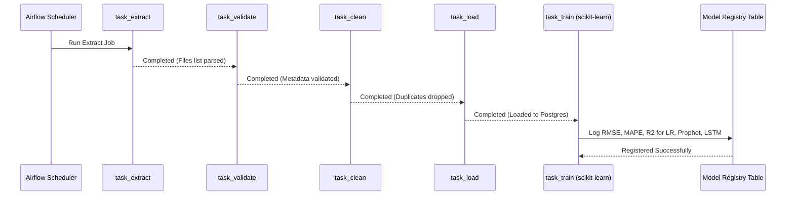
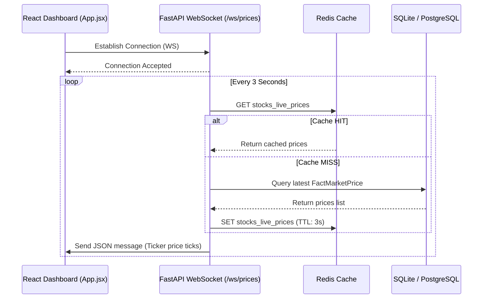

# MarketMind AI - Architecture & Design Specifications

This specification details the engineering systems design, ER schemas, and data pipelines structure of the MarketMind AI platform.

---

## 1. System Components Architecture

The architecture relies on loosely coupled services communicating via REST APIs, WebSockets, and a Kafka message broker.

---

## 2. Database Entity-Relationship (ER) Schema

The database model follows a high-performance Dimensional Star Schema optimized for financial time-series querying:

---

## 3. Data Streaming & Batch ETL Sequences

### Real-time Event Ingestion Flow

### Batch ETL & MLOps Training Pipeline (Airflow DAG)

### Live WebSocket Broadcast Flow

